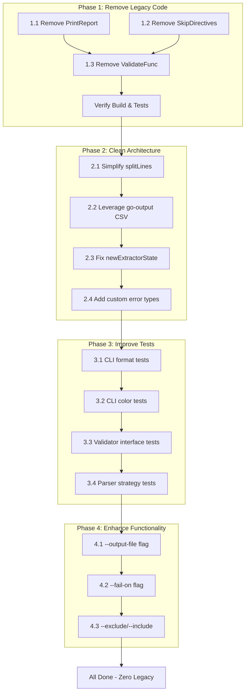

# Comprehensive Execution Plan - md-go-validator

**Created:** 2026-03-26 06:14  
**Version:** 1.0

---

## Executive Summary

This plan addresses technical debt, architectural issues, and test coverage improvements for md-go-validator. The goal is to reduce legacy code to ZERO, remove ghost systems, and improve maintainability.

---

## Current State Analysis (Updated: 2026-03-26)

### Test Coverage

| Package | Coverage | Status |
|---------|----------|--------|
| pkg/types | 91.0% | ✅ Good |
| pkg/output | 92.0% | ✅ Good |
| pkg | 85.2% | ✅ Good |
| cmd | 59.4% | ⚠️ Improved |

### Completed Tasks
- [x] Fix SkipDirectives undefined bug in extractor.go
- [x] Update README.md with new API (context + output package)
- [x] Add context cancellation tests
- [x] Add format flag parsing tests
- [x] Add color flag parsing tests
- [x] Add validatePath with mock validator test
- [x] Add validatePaths capacity test
- [x] go mod tidy fix

### Remaining Issues
- [ ] gosec G304 warning (path traversal) - documented as safe
- [ ] cmd package coverage could be higher (59.4%)

---

## Comprehensive Task List (30-100 min each)

### Phase 1: Remove Legacy Code (Impact: HIGH, Effort: LOW)

| # | Task | Effort | Impact | Priority |
|---|------|--------|--------|----------|
| 1.1 | Remove deprecated PrintReport from validator.go | 10 min | High | P0 |
| 1.2 | Remove deprecated SkipDirectives global from extractor.go | 10 min | High | P0 |
| 1.3 | Remove ValidateFunc type (ghost system) | 10 min | Medium | P1 |

### Phase 2: Clean Architecture (Impact: HIGH, Effort: MEDIUM)

| # | Task | Effort | Impact | Priority |
|---|------|--------|--------|----------|
| 2.1 | Simplify splitLines to use strings.Split | 5 min | Low | P2 |
| 2.2 | Leverage go-output's CSV formatting | 20 min | Medium | P1 |
| 2.3 | Fix newExtractorState to use SkipDirectivesConfig | 10 min | Medium | P1 |
| 2.4 | Add custom error types for validation | 30 min | High | P2 |

### Phase 3: Improve Test Coverage (Impact: MEDIUM, Effort: MEDIUM)

| # | Task | Effort | Impact | Priority |
|---|------|--------|--------|----------|
| 3.1 | Add CLI integration tests for --format flag | 30 min | High | P1 |
| 3.2 | Add CLI integration tests for --color flag | 20 min | Medium | P2 |
| 3.3 | Add Validator interface tests | 30 min | Medium | P2 |
| 3.4 | Add parser multi-strategy tests | 30 min | Medium | P2 |

### Phase 4: Enhance Functionality (Impact: MEDIUM, Effort: MEDIUM)

| # | Task | Effort | Impact | Priority |
|---|------|--------|--------|----------|
| 4.1 | Add --output-file flag for CI/CD | 40 min | High | P1 |
| 4.2 | Add --fail-on flag (error, warning) | 30 min | Medium | P2 |
| 4.3 | Add --exclude/--include glob patterns | 60 min | Medium | P2 |

---

## Detailed Sub-Tasks (Max 12 min each)

### 1.1 Remove deprecated PrintReport (10 min)

- [ ] 1.1.1 Delete PrintReport function from validator.go (lines 195-229)
- [ ] 1.1.2 Update main.go imports if needed
- [ ] 1.1.3 Verify tests still pass
- [ ] 1.1.4 Commit with message: `chore: remove deprecated PrintReport from validator.go`

### 1.2 Remove deprecated SkipDirectives (10 min)

- [ ] 1.2.1 Delete SkipDirectives global variable from extractor.go (lines 26-37)
- [ ] 1.2.2 Update hasSkipDirective to only use SkipDirectivesConfig
- [ ] 1.2.3 Update tests if they reference SkipDirectives
- [ ] 1.2.4 Commit with message: `chore: remove deprecated SkipDirectives global variable`

### 1.3 Remove ValidateFunc ghost system (10 min)

- [ ] 1.3.1 Check if ValidateFunc is used anywhere
- [ ] 1.3.2 Delete ValidateFunc type from validator_interface.go
- [ ] 1.3.3 Keep only the Validator interface
- [ ] 1.3.4 Commit with message: `chore: remove unused ValidateFunc ghost system`

### 2.1 Simplify splitLines (5 min)

- [ ] 2.1.1 Replace splitLines with strings.Split in output.go
- [ ] 2.1.2 Remove splitLines function
- [ ] 2.1.3 Commit with message: `refactor: use strings.Split instead of manual splitLines`

### 2.2 Leverage go-output CSV (20 min)

- [ ] 2.2.1 Check go-output for CSV marshaling capability
- [ ] 2.2.2 Replace manual CSV escaping with go-output
- [ ] 2.2.3 Simplify printCSV function
- [ ] 2.2.4 Commit with message: `refactor: use go-output CSV marshaling`

### 2.3 Fix newExtractorState (10 min)

- [ ] 2.3.1 Update newExtractorState to use DefaultSkipDirectives()
- [ ] 2.3.2 Remove fallback to global SkipDirectives
- [ ] 2.3.3 Commit with message: `fix: use SkipDirectivesConfig in newExtractorState`

### 2.4 Add custom error types (30 min)

- [ ] 2.4.1 Create pkg/errors/validation.go with error types
- [ ] 2.4.2 Add ValidationError, ParseError, FileError types
- [ ] 2.4.3 Update parser.go to use new error types
- [ ] 2.4.4 Commit with message: `feat: add custom validation error types`

### 3.1 CLI format tests (30 min)

- [ ] 3.1.1 Add TestParseArgsFormatFlag test
- [ ] 3.1.2 Add TestOutputFormatJSON integration test
- [ ] 3.1.3 Add TestOutputFormatMarkdown integration test
- [ ] 3.1.4 Add TestOutputFormatYAML integration test
- [ ] 3.1.5 Add TestOutputFormatCSV integration test
- [ ] 3.1.6 Commit with message: `test: add CLI format flag integration tests`

### 3.2 CLI color tests (20 min)

- [ ] 3.2.1 Add TestParseArgsColorFlag test
- [ ] 3.2.2 Add TestColorModeOutput test
- [ ] 3.2.3 Commit with message: `test: add CLI color mode tests`

### 3.3 Validator interface tests (30 min)

- [ ] 3.3.1 Add TestValidatorInterfaceMock test
- [ ] 3.3.2 Add TestFileValidatorImplementsInterface test
- [ ] 3.3.3 Commit with message: `test: add Validator interface tests`

### 3.4 Parser strategy tests (30 min)

- [ ] 3.4.1 Add TestValidateGoCode_CompleteFile test
- [ ] 3.4.2 Add TestValidateGoCode_PackageWrapper test
- [ ] 3.4.3 Add TestValidateGoCode_FunctionWrapper test
- [ ] 3.4.4 Add TestValidateGoCode_Expression test
- [ ] 3.4.5 Add TestValidateGoCode_Statements test
- [ ] 3.4.6 Commit with message: `test: add parser multi-strategy tests`

### 4.1 Add --output-file flag (40 min)

- [ ] 4.1.1 Add outputFile field to config struct
- [ ] 4.1.2 Add --output flag parsing
- [ ] 4.1.3 Modify PrintReport to write to file
- [ ] 4.1.4 Add tests for output file
- [ ] 4.1.5 Update printUsage help text
- [ ] 4.1.6 Commit with message: `feat: add --output-file flag for CI/CD`

### 4.2 Add --fail-on flag (30 min)

- [ ] 4.2.1 Add failOn field to config (error, warning, never)
- [ ] 4.2.2 Add --fail-on flag parsing
- [ ] 4.2.3 Modify exit logic based on failOn
- [ ] 4.2.4 Add tests
- [ ] 4.2.5 Commit with message: `feat: add --fail-on flag`

### 4.3 Add --exclude/--include (60 min)

- [ ] 4.3.1 Add exclude and include fields to config ([]string)
- [ ] 4.3.2 Add --exclude and --include flag parsing
- [ ] 4.3.3 Add glob matching logic to validator
- [ ] 4.3.4 Add tests for glob patterns
- [ ] 4.3.5 Update printUsage help text
- [ ] 4.3.6 Commit with message: `feat: add --exclude/--include glob pattern support`

---

## Mermaid Execution Graph

---

## Priority Matrix

| Priority | Task | Work | Impact | Value |
|----------|------|------|--------|-------|
| P0 | 1.1 Remove PrintReport | 10 min | High | 6x |
| P0 | 1.2 Remove SkipDirectives | 10 min | High | 6x |
| P1 | 1.3 Remove ValidateFunc | 10 min | Medium | 3x |
| P1 | 2.2 Leverage go-output CSV | 20 min | Medium | 2x |
| P1 | 2.3 Fix newExtractorState | 10 min | Medium | 3x |
| P1 | 3.1 CLI format tests | 30 min | High | 2x |
| P2 | 2.1 Simplify splitLines | 5 min | Low | 1x |
| P2 | 2.4 Custom error types | 30 min | High | 2x |
| P2 | 3.2 CLI color tests | 20 min | Medium | 1.5x |
| P2 | 3.3 Validator interface tests | 30 min | Medium | 1.5x |
| P2 | 3.4 Parser strategy tests | 30 min | Medium | 1.5x |
| P2 | 4.2 --fail-on flag | 30 min | Medium | 2x |
| P3 | 4.1 --output-file flag | 40 min | High | 1.5x |
| P3 | 4.3 --exclude/--include | 60 min | Medium | 1x |

---

## Total Estimated Time

- Phase 1: 30 min
- Phase 2: 65 min
- Phase 3: 110 min
- Phase 4: 130 min
- **Total: ~335 min (5.5 hours)**

---

## Next Actions

1. **IMMEDIATE**: Execute Phase 1 (P0 tasks)
2. Execute Phase 2 in parallel with Phase 3
3. Execute Phase 4 last (feature enhancements)

---

**End of Plan**
