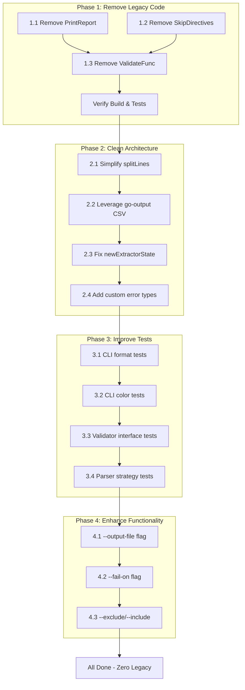

# Comprehensive Execution Plan - md-go-validator

> ARCHIVED 2026-09-26 — all phases completed within days of this plan (evidence in
> `docs/status/2026-03-26_15-35_COMPREHENSIVE_STATUS_REPORT.md`); 61 sub-task checkboxes
> struck. Current work: `TODO_LIST.md`.

**Created:** 2026-03-26 06:14\
**Version:** 1.0

---

## Executive Summary

This plan addresses technical debt, architectural issues, and test coverage improvements for md-go-validator. The goal is to reduce legacy code to ZERO, remove ghost systems, and improve maintainability.

---

## Current State Analysis (Updated: 2026-03-26)

### Test Coverage

| Package    | Coverage | Status     |
| ---------- | -------- | ---------- |
| pkg/types  | 91.0%    | ✅ Good    |
| pkg/output | 92.0%    | ✅ Good    |
| pkg        | 85.2%    | ✅ Good    |
| cmd        | 59.4%    | ⚠️ Improved |

### Completed Tasks

- [x] Fix SkipDirectives undefined bug in extractor.go
- [x] Update README.md with new API (context + output package)
- [x] Add context cancellation tests
- [x] Add format flag parsing tests
- [x] Add color flag parsing tests
- [x] Add validatePath with mock validator test
- [x] Add validatePaths capacity test
- [x] go mod tidy fix
- [x] **Phase 1.1:** Remove deprecated PrintReport from validator.go
- [x] **Phase 1.2:** Remove deprecated SkipDirectives global from extractor.go
- [x] **Phase 1.3:** ValidateFunc ghost system (never existed - only Validator interface)
- [x] **Phase 2.1:** Simplify splitLines (already uses strings.Split directly)
- [x] **Phase 2.2:** Leverage go-output CSV (already using CSVWriter)
- [x] **Phase 2.3:** Fix newExtractorState to use DefaultSkipDirectives()

### Remaining Issues

~~- [ ] gosec G304 warning (path traversal) - documented as safe~~ Won't fix — documented safe; null-byte guards shipped (`acfe5c4`)
~~- [ ] cmd package coverage could be higher (59.4%)~~ done at `f3a2c2c` (74.8%)
~~- [ ] Phase 2.4: Add custom error types (optional enhancement)~~ done at `6d269dd`
~~- [ ] Phase 4: Feature enhancements (--output-file, --fail-on, --exclude/--include)~~ done at `0bb2510`, `fe11609`, `da2f6f5`

---

## Comprehensive Task List (30-100 min each)

### Phase 1: Remove Legacy Code (Impact: HIGH, Effort: LOW)

| #   | Task                                                      | Effort | Impact | Priority |
| --- | --------------------------------------------------------- | ------ | ------ | -------- |
| 1.1 | Remove deprecated PrintReport from validator.go           | 10 min | High   | P0       |
| 1.2 | Remove deprecated SkipDirectives global from extractor.go | 10 min | High   | P0       |
| 1.3 | Remove ValidateFunc type (ghost system)                   | 10 min | Medium | P1       |

### Phase 2: Clean Architecture (Impact: HIGH, Effort: MEDIUM)

| #   | Task                                              | Effort | Impact | Priority |
| --- | ------------------------------------------------- | ------ | ------ | -------- |
~~| 2.1 | Simplify splitLines to use strings.Split          | 5 min  | Low    | P2       |~~ done — no-op (already used `strings.Split`)
~~| 2.2 | Leverage go-output's CSV formatting               | 20 min | Medium | P1       |~~ done at `84dab03`
~~| 2.3 | Fix newExtractorState to use SkipDirectivesConfig | 10 min | Medium | P1       |~~ done at `31b2272`
~~| 2.4 | Add custom error types for validation             | 30 min | High   | P2       |~~ done at `6d269dd`

### Phase 3: Improve Test Coverage (Impact: MEDIUM, Effort: MEDIUM)

| #   | Task                                        | Effort | Impact | Priority |
| --- | ------------------------------------------- | ------ | ------ | -------- |
~~| 3.1 | Add CLI integration tests for --format flag | 30 min | High   | P1       |~~ done at `dee7bc2`
~~| 3.2 | Add CLI integration tests for --color flag  | 20 min | Medium | P2       |~~ done at `dee7bc2`
~~| 3.3 | Add Validator interface tests               | 30 min | Medium | P2       |~~ done at `42b0a56`
~~| 3.4 | Add parser multi-strategy tests             | 30 min | Medium | P2       |~~ done at `cb3e883`

### Phase 4: Enhance Functionality (Impact: MEDIUM, Effort: MEDIUM)

| #   | Task                                  | Effort | Impact | Priority |
| --- | ------------------------------------- | ------ | ------ | -------- |
~~| 4.1 | Add --output-file flag for CI/CD      | 40 min | High   | P1       |~~ done at `0bb2510`
~~| 4.2 | Add --fail-on flag (error, warning)   | 30 min | Medium | P2       |~~ Won't implement as designed — shipped as `--fail-on-skipped` (`fe11609`)
~~| 4.3 | Add --exclude/--include glob patterns | 60 min | Medium | P2       |~~ done at `da2f6f5`, `ce25525`

---

## Detailed Sub-Tasks (Max 12 min each)

### 1.1 Remove deprecated PrintReport (10 min)

~~- [ ] 1.1.1 Delete PrintReport function from validator.go (lines 195-229)~~ done — phase completed (see docs/status/2026-03-26_15-35)
~~- [ ] 1.1.2 Update main.go imports if needed~~ done — phase completed (see docs/status/2026-03-26_15-35)
~~- [ ] 1.1.3 Verify tests still pass~~ done — phase completed (see docs/status/2026-03-26_15-35)
~~- [ ] 1.1.4 Commit with message: `chore: remove deprecated PrintReport from validator.go`~~ done — phase completed (see docs/status/2026-03-26_15-35)

### 1.2 Remove deprecated SkipDirectives (10 min)

~~- [ ] 1.2.1 Delete SkipDirectives global variable from extractor.go (lines 26-37)~~ done — phase completed (see docs/status/2026-03-26_15-35)
~~- [ ] 1.2.2 Update hasSkipDirective to only use SkipDirectivesConfig~~ done — phase completed (see docs/status/2026-03-26_15-35)
~~- [ ] 1.2.3 Update tests if they reference SkipDirectives~~ done — phase completed (see docs/status/2026-03-26_15-35)
~~- [ ] 1.2.4 Commit with message: `chore: remove deprecated SkipDirectives global variable`~~ done — phase completed (see docs/status/2026-03-26_15-35)

### 1.3 Remove ValidateFunc ghost system (10 min)

~~- [ ] 1.3.1 Check if ValidateFunc is used anywhere~~ done — phase completed (see docs/status/2026-03-26_15-35)
~~- [ ] 1.3.2 Delete ValidateFunc type from validator_interface.go~~ done — phase completed (see docs/status/2026-03-26_15-35)
~~- [ ] 1.3.3 Keep only the Validator interface~~ done — phase completed (see docs/status/2026-03-26_15-35)
~~- [ ] 1.3.4 Commit with message: `chore: remove unused ValidateFunc ghost system`~~ done — phase completed (see docs/status/2026-03-26_15-35)

### 2.1 Simplify splitLines (5 min)

~~- [ ] 2.1.1 Replace splitLines with strings.Split in output.go~~ done — phase completed (see docs/status/2026-03-26_15-35)
~~- [ ] 2.1.2 Remove splitLines function~~ done — phase completed (see docs/status/2026-03-26_15-35)
~~- [ ] 2.1.3 Commit with message: `refactor: use strings.Split instead of manual splitLines`~~ done — phase completed (see docs/status/2026-03-26_15-35)

### 2.2 Leverage go-output CSV (20 min)

~~- [ ] 2.2.1 Check go-output for CSV marshaling capability~~ done — phase completed (see docs/status/2026-03-26_15-35)
~~- [ ] 2.2.2 Replace manual CSV escaping with go-output~~ done — phase completed (see docs/status/2026-03-26_15-35)
~~- [ ] 2.2.3 Simplify printCSV function~~ done — phase completed (see docs/status/2026-03-26_15-35)
~~- [ ] 2.2.4 Commit with message: `refactor: use go-output CSV marshaling`~~ done — phase completed (see docs/status/2026-03-26_15-35)

### 2.3 Fix newExtractorState (10 min)

~~- [ ] 2.3.1 Update newExtractorState to use DefaultSkipDirectives()~~ done — phase completed (see docs/status/2026-03-26_15-35)
~~- [ ] 2.3.2 Remove fallback to global SkipDirectives~~ done — phase completed (see docs/status/2026-03-26_15-35)
~~- [ ] 2.3.3 Commit with message: `fix: use SkipDirectivesConfig in newExtractorState`~~ done — phase completed (see docs/status/2026-03-26_15-35)

### 2.4 Add custom error types (30 min)

~~- [ ] 2.4.1 Create pkg/errors/validation.go with error types~~ done — phase completed (see docs/status/2026-03-26_15-35)
~~- [ ] 2.4.2 Add ValidationError, ParseError, FileError types~~ done — phase completed (see docs/status/2026-03-26_15-35)
~~- [ ] 2.4.3 Update parser.go to use new error types~~ done — phase completed (see docs/status/2026-03-26_15-35)
~~- [ ] 2.4.4 Commit with message: `feat: add custom validation error types`~~ done — phase completed (see docs/status/2026-03-26_15-35)

### 3.1 CLI format tests (30 min)

~~- [ ] 3.1.1 Add TestParseArgsFormatFlag test~~ done — phase completed (see docs/status/2026-03-26_15-35)
~~- [ ] 3.1.2 Add TestOutputFormatJSON integration test~~ done — phase completed (see docs/status/2026-03-26_15-35)
~~- [ ] 3.1.3 Add TestOutputFormatMarkdown integration test~~ done — phase completed (see docs/status/2026-03-26_15-35)
~~- [ ] 3.1.4 Add TestOutputFormatYAML integration test~~ done — phase completed (see docs/status/2026-03-26_15-35)
~~- [ ] 3.1.5 Add TestOutputFormatCSV integration test~~ done — phase completed (see docs/status/2026-03-26_15-35)
~~- [ ] 3.1.6 Commit with message: `test: add CLI format flag integration tests`~~ done — phase completed (see docs/status/2026-03-26_15-35)

### 3.2 CLI color tests (20 min)

~~- [ ] 3.2.1 Add TestParseArgsColorFlag test~~ done — phase completed (see docs/status/2026-03-26_15-35)
~~- [ ] 3.2.2 Add TestColorModeOutput test~~ done — phase completed (see docs/status/2026-03-26_15-35)
~~- [ ] 3.2.3 Commit with message: `test: add CLI color mode tests`~~ done — phase completed (see docs/status/2026-03-26_15-35)

### 3.3 Validator interface tests (30 min)

~~- [ ] 3.3.1 Add TestValidatorInterfaceMock test~~ done — phase completed (see docs/status/2026-03-26_15-35)
~~- [ ] 3.3.2 Add TestFileValidatorImplementsInterface test~~ done — phase completed (see docs/status/2026-03-26_15-35)
~~- [ ] 3.3.3 Commit with message: `test: add Validator interface tests`~~ done — phase completed (see docs/status/2026-03-26_15-35)

### 3.4 Parser strategy tests (30 min)

~~- [ ] 3.4.1 Add TestValidateGoCode_CompleteFile test~~ done — phase completed (see docs/status/2026-03-26_15-35)
~~- [ ] 3.4.2 Add TestValidateGoCode_PackageWrapper test~~ done — phase completed (see docs/status/2026-03-26_15-35)
~~- [ ] 3.4.3 Add TestValidateGoCode_FunctionWrapper test~~ done — phase completed (see docs/status/2026-03-26_15-35)
~~- [ ] 3.4.4 Add TestValidateGoCode_Expression test~~ done — phase completed (see docs/status/2026-03-26_15-35)
~~- [ ] 3.4.5 Add TestValidateGoCode_Statements test~~ done — phase completed (see docs/status/2026-03-26_15-35)
~~- [ ] 3.4.6 Commit with message: `test: add parser multi-strategy tests`~~ done — phase completed (see docs/status/2026-03-26_15-35)

### 4.1 Add --output-file flag (40 min)

~~- [ ] 4.1.1 Add outputFile field to config struct~~ done — phase completed (see docs/status/2026-03-26_15-35)
~~- [ ] 4.1.2 Add --output flag parsing~~ done — phase completed (see docs/status/2026-03-26_15-35)
~~- [ ] 4.1.3 Modify PrintReport to write to file~~ done — phase completed (see docs/status/2026-03-26_15-35)
~~- [ ] 4.1.4 Add tests for output file~~ done — phase completed (see docs/status/2026-03-26_15-35)
~~- [ ] 4.1.5 Update printUsage help text~~ done — phase completed (see docs/status/2026-03-26_15-35)
~~- [ ] 4.1.6 Commit with message: `feat: add --output-file flag for CI/CD`~~ done — phase completed (see docs/status/2026-03-26_15-35)

### 4.2 Add --fail-on flag (30 min)

~~- [ ] 4.2.1 Add failOn field to config (error, warning, never)~~ done — phase completed (see docs/status/2026-03-26_15-35)
~~- [ ] 4.2.2 Add --fail-on flag parsing~~ done — phase completed (see docs/status/2026-03-26_15-35)
~~- [ ] 4.2.3 Modify exit logic based on failOn~~ done — phase completed (see docs/status/2026-03-26_15-35)
~~- [ ] 4.2.4 Add tests~~ done — phase completed (see docs/status/2026-03-26_15-35)
~~- [ ] 4.2.5 Commit with message: `feat: add --fail-on flag`~~ done — phase completed (see docs/status/2026-03-26_15-35)

### 4.3 Add --exclude/--include (60 min)

~~- [ ] 4.3.1 Add exclude and include fields to config ([]string)~~ done — phase completed (see docs/status/2026-03-26_15-35)
~~- [ ] 4.3.2 Add --exclude and --include flag parsing~~ done — phase completed (see docs/status/2026-03-26_15-35)
~~- [ ] 4.3.3 Add glob matching logic to validator~~ done — phase completed (see docs/status/2026-03-26_15-35)
~~- [ ] 4.3.4 Add tests for glob patterns~~ done — phase completed (see docs/status/2026-03-26_15-35)
~~- [ ] 4.3.5 Update printUsage help text~~ done — phase completed (see docs/status/2026-03-26_15-35)
~~- [ ] 4.3.6 Commit with message: `feat: add --exclude/--include glob pattern support`~~ done — phase completed (see docs/status/2026-03-26_15-35)

---

## Mermaid Execution Graph

```mermaid
graph TD
    subgraph Phase1["Phase 1: Remove Legacy Code"]
        A1[1.1 Remove PrintReport] --> A3[1.3 Remove ValidateFunc]
        A2[1.2 Remove SkipDirectives] --> A3
        A3 --> B1[Verify Build & Tests]
    end

    subgraph Phase2["Phase 2: Clean Architecture"]
        B1 --> C1[2.1 Simplify splitLines]
        C1 --> C2[2.2 Leverage go-output CSV]
        C2 --> C3[2.3 Fix newExtractorState]
        C3 --> C4[2.4 Add custom error types]
    end

    subgraph Phase3["Phase 3: Improve Tests"]
        C4 --> D1[3.1 CLI format tests]
        D1 --> D2[3.2 CLI color tests]
        D2 --> D3[3.3 Validator interface tests]
        D3 --> D4[3.4 Parser strategy tests]
    end

    subgraph Phase4["Phase 4: Enhance Functionality"]
        D4 --> E1[4.1 --output-file flag]
        E1 --> E2[4.2 --fail-on flag]
        E2 --> E3[4.3 --exclude/--include]
    end

    E3 --> Final[All Done - Zero Legacy]
```

---

## Priority Matrix

| Priority | Task                          | Work   | Impact | Value |
| -------- | ----------------------------- | ------ | ------ | ----- |
| P0       | 1.1 Remove PrintReport        | 10 min | High   | 6x    |
| P0       | 1.2 Remove SkipDirectives     | 10 min | High   | 6x    |
| P1       | 1.3 Remove ValidateFunc       | 10 min | Medium | 3x    |
| P1       | 2.2 Leverage go-output CSV    | 20 min | Medium | 2x    |
| P1       | 2.3 Fix newExtractorState     | 10 min | Medium | 3x    |
| P1       | 3.1 CLI format tests          | 30 min | High   | 2x    |
| P2       | 2.1 Simplify splitLines       | 5 min  | Low    | 1x    |
| P2       | 2.4 Custom error types        | 30 min | High   | 2x    |
| P2       | 3.2 CLI color tests           | 20 min | Medium | 1.5x  |
| P2       | 3.3 Validator interface tests | 30 min | Medium | 1.5x  |
| P2       | 3.4 Parser strategy tests     | 30 min | Medium | 1.5x  |
| P2       | 4.2 --fail-on flag            | 30 min | Medium | 2x    |
| P3       | 4.1 --output-file flag        | 40 min | High   | 1.5x  |
| P3       | 4.3 --exclude/--include       | 60 min | Medium | 1x    |

---

## Total Estimated Time

- Phase 1: 30 min
- Phase 2: 65 min
- Phase 3: 110 min
- Phase 4: 130 min
- **Total: ~335 min (5.5 hours)**

---

## Next Actions

1. **IMMEDIATE**: Execute Phase 1 (P0 tasks)
2. Execute Phase 2 in parallel with Phase 3
3. Execute Phase 4 last (feature enhancements)

---

**End of Plan**
