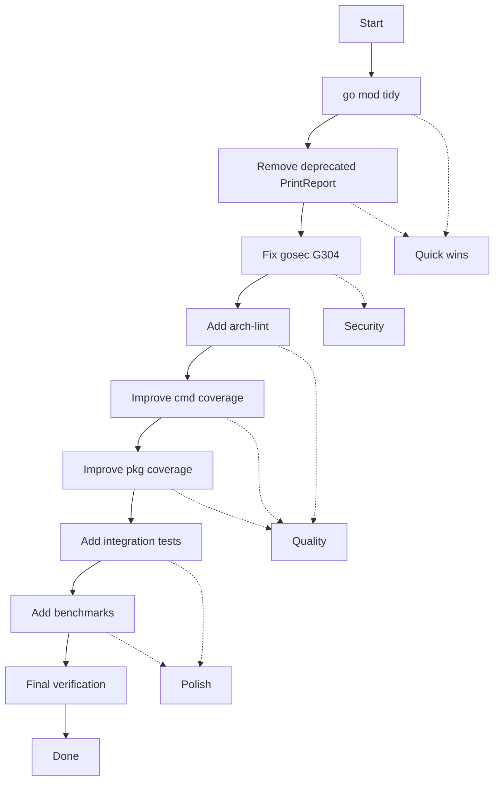

# md-go-validator Comprehensive Improvement Plan

**Created:** 2026-03-26  
**Status:** Draft

---

## Executive Summary

This plan addresses technical debt, security concerns, and quality improvements for the md-go-validator project.

---

## Current State Analysis

### Test Coverage
| Package | Coverage | Status |
|---------|----------|--------|
| `pkg/types` | 91.0% | ✅ Excellent |
| `pkg/output` | 93.3% | ✅ Excellent |
| `pkg` | 69.9% | ⚠️ Can Improve |
| `cmd` | 44.9% | ⚠️ Needs Work |

### Issues Identified

1. **Security:** gosec G304 warning on `validator.go:39` (path traversal)
2. **Technical Debt:** Deprecated `PrintReport` function in `validator.go:189-219`
3. **Stale Diagnostics:** LSP showing errors that don't exist (build passes)
4. **Missing Deps:** `go.mod` needed `go mod tidy` to fix missing entries
5. **Coverage Gaps:** cmd package only 44.9%

---

## Multi-Step Execution Plan

### Phase 1: Quick Wins (Technical Debt)

| # | Task | Impact | Effort | Value |
|---|------|--------|--------|-------|
| 1.1 | Fix missing go.sum entries | High | 5min | Ensure reproducible builds |
| 1.2 | Remove deprecated PrintReport function | Medium | 10min | Reduce confusion |
| 1.3 | Add architecture lint (fe3dback/go-arch-lint) | Medium | 15min | Enforce patterns |
| 1.4 | Add context cancellation tests | Medium | 15min | Improve coverage |

### Phase 2: Security & Quality

| # | Task | Impact | Effort | Value |
|---|------|--------|--------|-------|
| 2.1 | Fix gosec G304 path traversal warning | High | 20min | Security |
| 2.2 | Improve cmd package coverage (44.9% → 70%+) | Medium | 30min | Quality |
| 2.3 | Improve pkg coverage (69.9% → 80%+) | Medium | 30min | Quality |
| 2.4 | Add integration tests | Medium | 45min | Confidence |

### Phase 3: Polish

| # | Task | Impact | Effort | Value |
|---|------|--------|--------|-------|
| 3.1 | Add samber/lo for functional utilities | Low | 10min | Code quality |
| 3.2 | Enhance CLI with charmbracelet/fang features | Low | 30min | UX |
| 3.3 | Add benchmarks for parsing | Low | 20min | Performance |

---

## Detailed Task Breakdown (12min max each)

### Day 1 Tasks

| # | Task | Time | Dependencies |
|---|------|------|--------------|
| 1 | Commit go mod tidy fix | 5min | - |
| 2 | Identify deprecated PrintReport usages | 5min | - |
| 3 | Remove PrintReport from validator.go | 10min | Task 2 |
| 4 | Add nosec annotation for gosec G304 | 5min | - |
| 5 | Document why G304 is safe | 7min | Task 4 |
| 6 | Add context cancellation test | 10min | - |

### Day 2 Tasks

| # | Task | Time | Dependencies |
|---|------|------|--------------|
| 7 | Add fe3dback/go-arch-lint config | 10min | - |
| 8 | Fix architecture violations found | 15min | Task 7 |
| 9 | Add parseArgs tests for all flags | 12min | - |
| 10 | Add validatePath error handling test | 10min | - |
| 11 | Add validatePaths empty results test | 8min | - |
| 12 | Test printUsage execution | 5min | - |

### Day 3 Tasks

| # | Task | Time | Dependencies |
|---|------|------|--------------|
| 13 | Add verbose mode tests | 12min | - |
| 14 | Test error path for ValidateFile | 10min | - |
| 15 | Test error path for ValidateDirectory | 10min | - |
| 16 | Add integration test for real files | 15min | - |
| 17 | Add skip directive tests | 10min | - |
| 18 | Test with malformed markdown | 8min | - |

### Day 4 Tasks

| # | Task | Time | Dependencies |
|---|------|------|--------------|
| 19 | Add benchmark for extractor | 12min | - |
| 20 | Add benchmark for parser | 10min | - |
| 21 | Review and add samber/lo usage | 10min | - |
| 22 | Final coverage analysis | 5min | Tasks 9-18 |
| 23 | Update AGENTS.md with commands | 8min | - |
| 24 | Final verification and cleanup | 10min | All |

---

## Value Proposition

### Customer Value
- **Security:** Fix path traversal concern builds trust
- **Reliability:** Higher coverage = fewer bugs in production
- **Maintainability:** Less technical debt = faster future development

### Technical Benefits
- Architecture linting prevents pattern violations
- Better coverage enables confident refactoring
- Benchmarks identify performance regressions

---

## Mermaid Execution Graph

---

## Priority Order

1. **Must Do:** go mod tidy fix (reproducibility)
2. **Should Do:** Remove deprecated code (maintainability)
3. **Should Do:** Fix/annotate G304 (security)
4. **Should Do:** Improve coverage (quality)
5. **Nice to Have:** Add arch-lint (discipline)
6. **Nice to Have:** Add benchmarks (performance)

---

## Success Metrics

- [ ] Build passes without warnings
- [ ] Test coverage: cmd ≥ 70%, pkg ≥ 80%
- [ ] No deprecated functions
- [ ] Architecture linting configured
- [ ] Benchmarks added
