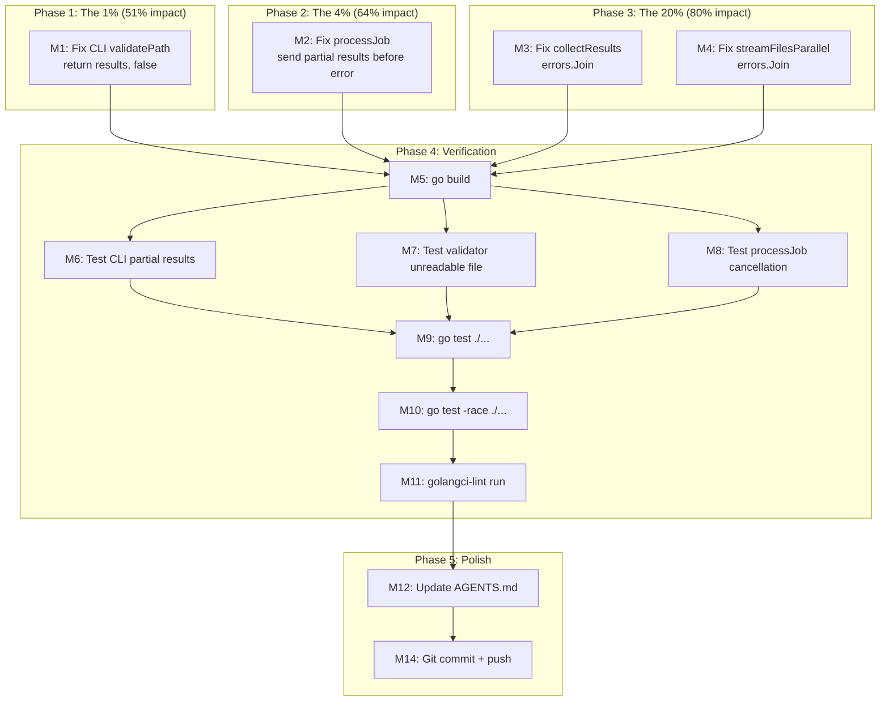

# Plan: Partial Results Recovery Fix

**Date:** 2026-08-05 11:15
**Status:** Ready for execution
**Risk:** Low — surgical fixes to error-handling paths, no API changes

---

## Problem Summary

Running the validator on a directory containing one unreadable file (missing, permission-denied, or TOCTOU) produces a **0/0/0 report** — discarding all successfully-validated blocks. The final error message says "encountered 56 errors" but only surfaces the first.

Three bugs compound:

| # | Bug | Location | Severity |
|---|-----|----------|----------|
| 1 | CLI discards partial results on error | `cmd/md-go-validator/main.go:596` | Critical |
| 2 | `processJob` drops partial results when `ValidateFile` returns error | `pkg/validator.go:534-537` | High |
| 3 | `collectResults`/`streamFilesParallel` wrap only the first error | `pkg/validator.go:583, 416` | Medium |

---

## Root Cause Analysis

### Call chain (what happens today)

```
ValidateDirectory
  → collectSupportedFiles (walks tree, collects paths)
  → processFilesParallel
    → startWorkers (N workers)
    → feedJobs (sends paths to jobs channel)
    → collectResults (drains results + errors channels)
      → if any errors: return (allResults, fmt.Errorf("encountered %d errors: %w", len(errs), errs[0]))
                     ↑ Bug 3: only errs[0] is surfaced

processJob (per worker):
  ValidateFile(ctx, path)
    → os.ReadFile → if fail: return (nil, err)
    → validateBlocks → if ctx cancelled mid-way: return (partialResults, ctxErr)
  if err != nil:
    errors <- error          ← Bug 2: partialResults silently dropped
    continue
  results <- fileResults

validatePath (CLI):
  results, err = validator.ValidateDirectory(ctx, path)
  if err != nil:
    return nil, false        ← Bug 1: all results discarded, report shows 0/0/0
```

### What should happen

1. `processJob` should send partial results BEFORE the error when `ValidateFile` returns both
2. `collectResults` should preserve all errors via `errors.Join`
3. `validatePath` (CLI) should return partial results, not nil

---

## Pareto Breakdown

### The 1% that delivers 51%

**Fix Bug 1:** One-line change in `main.go:596` — `return nil, false` → `return results, false`.

This alone makes the report show every block from every successfully-processed file. The only results still lost are partial results from the file that triggered the error (Bug 2).

### The 4% that delivers 64%

**Fix Bug 1 + Bug 2:** `processJob` sends partial results before error.

With both fixes, even context-cancellation mid-validation preserves the blocks that were validated before the timeout.

### The 20% that delivers 80%

**Fix Bug 1 + Bug 2 + Bug 3:** `errors.Join` in both `collectResults` and `streamFilesParallel`.

All three fixes + regression tests covering:
- Directory with unreadable file → partial results preserved
- Context cancellation mid-validation → partial results preserved
- Multiple errors → all surfaced via `errors.Join`

### The other 20% (to 100%)

- AGENTS.md documentation of partial-results-on-error contract
- Full test suite + race detector + lint verification
- Planning doc + commit + push

---

## Comprehensive Task List (30-100 min)

| ID | Task | Impact | Effort | Priority |
|----|------|--------|--------|----------|
| T1 | Fix Bug 1: CLI `validatePath` returns partial results | Critical | 30 min | P0 |
| T2 | Fix Bug 2: `processJob` sends partial results on error | High | 40 min | P0 |
| T3 | Fix Bug 3: `errors.Join` in `collectResults` + `streamFilesParallel` | Medium | 30 min | P1 |
| T4 | Write regression tests (3 tests: CLI, validator, error-join) | High | 90 min | P1 |
| T5 | Run full verification (build + test + race + lint) | Critical | 30 min | P0 |
| T6 | Update AGENTS.md with partial-results contract | Low | 30 min | P2 |
| T7 | Write planning doc + commit + push | Low | 30 min | P2 |

---

## Micro-Task Breakdown (max 12 min each)

| ID | Task | Est | Depends On |
|----|------|-----|------------|
| M1 | Edit `main.go:596`: `return nil, false` → `return results, false` | 3 min | — |
| M2 | Edit `processJob` in `validator.go`: send partial results before error | 5 min | — |
| M3 | Edit `collectResults` in `validator.go`: `errors.Join(errs...)` instead of `errs[0]` | 3 min | — |
| M4 | Edit `streamFilesParallel` in `validator.go`: same `errors.Join` fix | 3 min | — |
| M5 | Verify no syntax errors via `go build ./cmd/md-go-validator` | 2 min | M1-M4 |
| M6 | Write `TestValidatePath_PartialResultsOnDirectoryError` in main_test.go | 12 min | M5 |
| M7 | Write `TestValidator_ValidateDirectory_UnreadableFile` in validator_test.go | 12 min | M5 |
| M8 | Write `TestValidator_ProcessJob_PartialResultsOnCancellation` in validator_test.go | 10 min | M5 |
| M9 | Run `go test ./...` | 5 min | M6-M8 |
| M10 | Run `go test -race ./...` | 5 min | M9 |
| M11 | Run `golangci-lint run ./...` | 5 min | M10 |
| M12 | Update AGENTS.md error-handling section | 5 min | M11 |
| M13 | Write this planning doc (already in progress) | 10 min | — |
| M14 | Git commit with detailed message | 5 min | M12 |

---

## Execution Graph



---

## Safety Analysis

### What could go wrong (and why it won't)

| Risk | Mitigation |
|------|------------|
| `processJob` sends to results channel that's not ready | Channels are buffered to `len(filesToProcess)` — each file sends at most 1 result + 1 error |
| `errors.Join` changes error message format | Existing tests check `strings.Contains`, not exact match. "cancelled" still appears in joined error |
| `TestValidatePathWithErrors` expects `nil` for non-existent path | That test hits `os.Stat` failure, NOT `ValidateDirectory` error — unaffected |
| Partial results from cancelled file double-count | No: `processJob` sends the results slice once, then the error. No duplication |
| Race condition: worker sends results + error in new order | Channels are independent. Order within a worker doesn't matter. Buffer prevents blocking |

### What I'm NOT changing

- No new types or status enums (would be a larger design change)
- No API signature changes
- No changes to `ValidateFile` return contract (still returns `(results, error)`)
- No changes to how blocks are validated
- No changes to the worker pool architecture

---

## Detailed Change Specifications

### M1: CLI `validatePath` (`cmd/md-go-validator/main.go:593-597`)

```go
// BEFORE:
if err != nil {
    fmt.Fprintf(os.Stderr, "Error validating %s: %v\n", absPath, err)
    return nil, false
}

// AFTER:
if err != nil {
    fmt.Fprintf(os.Stderr, "Error validating %s: %v\n", absPath, err)
    return results, false
}
```

### M2: `processJob` (`pkg/validator.go:533-538`)

```go
// BEFORE:
fileResults, err := v.ValidateFile(ctx, path)
if err != nil {
    chans.errors <- fmt.Errorf("file %s: %w", path, err)
    continue
}

// AFTER:
fileResults, err := v.ValidateFile(ctx, path)
if err != nil {
    if fileResults != nil {
        chans.results <- fileResults
    }
    chans.errors <- fmt.Errorf("file %s: %w", path, err)
    continue
}
```

### M3: `collectResults` (`pkg/validator.go:582-583`)

```go
// BEFORE:
if len(errs) > 0 {
    return allResults, fmt.Errorf("encountered %d errors: %w", len(errs), errs[0])
}

// AFTER:
if len(errs) > 0 {
    return allResults, fmt.Errorf("encountered %d error(s): %w", len(errs), errors.Join(errs...))
}
```

### M4: `streamFilesParallel` (`pkg/validator.go:415-416`)

Same pattern as M3.
